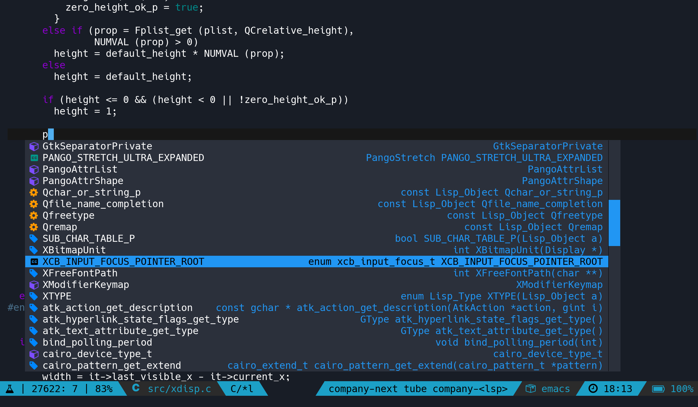

[](https://www.gnu.org/licenses/gpl-3.0)
[](https://celpa.conao3.com/#/company-box)
[](https://jcs-emacs.github.io/jcs-elpa/#/company-box)

# company-box

[](https://github.com/elp-revive/company-box/actions/workflows/test.yml)

A company front-end with icons.



Differences with the built-in front-end:
- Differents colors for differents backends.
- Icons associated to functions/variables/.. and their backends
- Display candidate's documentation (support `quickhelp-string`)
- Not limited by the current window size, buffer's text properties, .. (it's better than you might think)

This package requires emacs 26.
Also, not compatible with emacs in a tty.

### Installation
``` el
;; With use-package:
(use-package company-box
  :hook (company-mode . company-box-mode))

;; Or:
(require 'company-box)
(add-hook 'company-mode-hook 'company-box-mode)
```

To customize:
`M-x customize-group [RET] company-box [RET]`

### Backends colors

See the docstring of the variable `company-box-backends-colors`:
`C-h v company-box-backends-colors`

### Themes

You can select different themes with `company-box-icons-alist`

### Icons

See the variable `company-box-icons-functions`

For now, there are customs icons for 4 backends only: `company-lsp`, `company-elisp`, `company-yasnippet` and `company-php`.
You can customize their icons with the variables:
`company-box-icons-lsp`, `company-box-icons-elisp`, `company-box-icons-yasnippet` and `company-box-icons-acphp`.

Notes:
By default, images are used to display icons.
You can also use [font icons](https://github.com/sebastiencs/company-box/wiki/icons)
With images, you can't change icons colors
